# ForkIt

[ForkIt](#) is a full-stack recipe sharing community built with Django, designed to bring together home cooks and food lovers. Users can discover, share and manage their own recipes whilst engaging with the community through comments and ratings.

 _(add amiresponsive screenshot here)_

[Click here to view the deployed site.](#) _(add Heroku URL here)_

---

## Table of Contents

- [Project Purpose](#project-purpose)
- [User Experience (UX)](#user-experience-ux)
  - [Goals and Objectives](#goals-and-objectives)
  - [User Stories](#user-stories)
  - [Wireframes](#wireframes)
- [Database Design](#database-design)
  - [ERD](#erd)
  - [Database Schema](#database-schema)
- [UI Design](#ui-design)
  - [Colour Scheme](#colour-scheme)
  - [Typography](#typography)
  - [Imagery](#imagery)
- [Features](#features)
- [Technologies Used](#technologies-used)
- [Security Features](#security-features)
- [Deployment](#deployment)
- [Testing](#testing)
- [Bugs](#bugs)
- [Credits](#credits)

---

## Project Purpose

ForkIt is a community-driven recipe sharing platform where registered users can post their own recipes, browse recipes shared by others, leave comments and rate dishes. The site provides value to home cooks looking for inspiration and to those wanting to share their culinary creations with a wider audience.

The site owner benefits by building an engaged food community and growing a valuable dataset of user-generated recipes.

---

## User Experience (UX)

### Goals and Objectives

**External user goals:**

- Browse and discover recipes shared by the community
- Share their own recipes with other food lovers
- Engage with other users through comments and ratings
- Manage their own content easily

**Site owner goals:**

- Build an engaged recipe sharing community
- Collect a valuable dataset of user-generated recipes
- Provide a platform that is intuitive and enjoyable to use

### User Stories

#### Site Visitor (not logged in)

- As a site visitor, I want to browse all recipes so that I can find cooking inspiration
- As a site visitor, I want to search recipes by keyword so that I can find specific dishes quickly
- As a site visitor, I want to filter recipes by category so that I can browse recipes relevant to my diet or mood
- As a site visitor, I want to view a full recipe detail page so that I can see ingredients and instructions
- As a site visitor, I want to register for an account so that I can share my own recipes

#### Registered User

- As a registered user, I want to log in to my account so that I can access my profile and recipes
- As a registered user, I want to add a new recipe so that I can share it with the community
- As a registered user, I want to upload an image with my recipe so that it looks appealing to other users
- As a registered user, I want to edit my own recipes so that I can correct mistakes or update them
- As a registered user, I want to delete my own recipes so that I can remove content I no longer want to share
- As a registered user, I want to leave a comment on a recipe so that I can share feedback with the author
- As a registered user, I want to delete my own comments so that I can remove something I posted
- As a registered user, I want to rate a recipe out of 5 stars so that I can help others decide what to cook
- As a registered user, I want to view my profile page so that I can see all my posted recipes in one place
- As a registered user, I want to log out securely so that my account is protected

#### Site Owner

- As the site owner, I want only logged-in users to add, edit or delete recipes so that content is managed responsibly
- As the site owner, I want users to only edit or delete their own content so that other users' recipes are protected
- As the site owner, I want an admin panel so that I can manage categories, users and recipes if needed
- As the site owner, I want the site to be fully responsive so that users on mobile devices have a good experience

### Wireframes

_(Add wireframe screenshots from Base44 here)_

<details>
<summary>Homepage</summary>

 _(add wireframe image)_

</details>

<details>
<summary>Recipe Detail Page</summary>

 _(add wireframe image)_

</details>

<details>
<summary>Add Recipe Form</summary>

 _(add wireframe image)_

</details>

<details>
<summary>Profile Page</summary>

 _(add wireframe image)_

</details>

<details>
<summary>Login / Register</summary>

 _(add wireframe image)_

</details>

---

## Database Design

### ERD

_(Add ERD diagram image here)_

The application is built around five main entities:

- **User** — Django's built-in User model. A user can create many recipes, comments and ratings.
- **Category** — Groups recipes by cuisine or type (e.g. Italian, Vegan, Desserts).
- **Recipe** — Belongs to one user and one category. Can receive many comments and ratings.
- **Comment** — Belongs to one user and one recipe.
- **Rating** — A star rating (1-5) given by one user to one recipe. Each user can only rate a recipe once.

### Database Schema

| Model    | Field        | Type          | Notes      |
| -------- | ------------ | ------------- | ---------- |
| Category | name         | CharField     |            |
| Category | slug         | SlugField     | Unique     |
| Recipe   | title        | CharField     |            |
| Recipe   | slug         | SlugField     | Unique     |
| Recipe   | description  | TextField     |            |
| Recipe   | ingredients  | TextField     |            |
| Recipe   | instructions | TextField     |            |
| Recipe   | cooking_time | IntegerField  | Minutes    |
| Recipe   | servings     | IntegerField  | Default 4  |
| Recipe   | image        | ImageField    | Optional   |
| Recipe   | author       | ForeignKey    | → User     |
| Recipe   | category     | ForeignKey    | → Category |
| Recipe   | created_at   | DateTimeField | Auto       |
| Recipe   | updated_at   | DateTimeField | Auto       |
| Comment  | body         | TextField     |            |
| Comment  | recipe       | ForeignKey    | → Recipe   |
| Comment  | author       | ForeignKey    | → User     |
| Comment  | created_at   | DateTimeField | Auto       |
| Rating   | score        | IntegerField  | 1-5        |
| Rating   | recipe       | ForeignKey    | → Recipe   |
| Rating   | user         | ForeignKey    | → User     |
| Rating   | created_at   | DateTimeField | Auto       |

**Relationships:**

- A User can have many Recipes (one-to-many)
- A User can have many Comments (one-to-many)
- A User can have many Ratings (one-to-many)
- A Category can have many Recipes (one-to-many)
- A Recipe can have many Comments (one-to-many)
- A Recipe can have many Ratings (one-to-many)
- A User can only rate each Recipe once (enforced via unique_together)

---

## UI Design

### Colour Scheme

_(Add colour palette image here)_

The colour scheme uses warm, food-inspired tones:

- **Terracotta (#C46438)** — primary actions, buttons, highlights
- **Olive Green (#58B783)** — accents, category badges
- **Cream (#FAF7F2)** — page background
- **Dark Brown (#2C1810)** — body text

These colours were chosen to evoke warmth and appetite, consistent with a food-focused platform.

### Typography

_(Add font screenshots here)_

- **Headings:** _(add font name)_
- **Body text:** _(add font name)_

### Imagery

Food photography is sourced from [Pexels](https://www.pexels.com/) which provides free-to-use images. Users can upload their own recipe images via Cloudinary.

---

## Features

### Comments


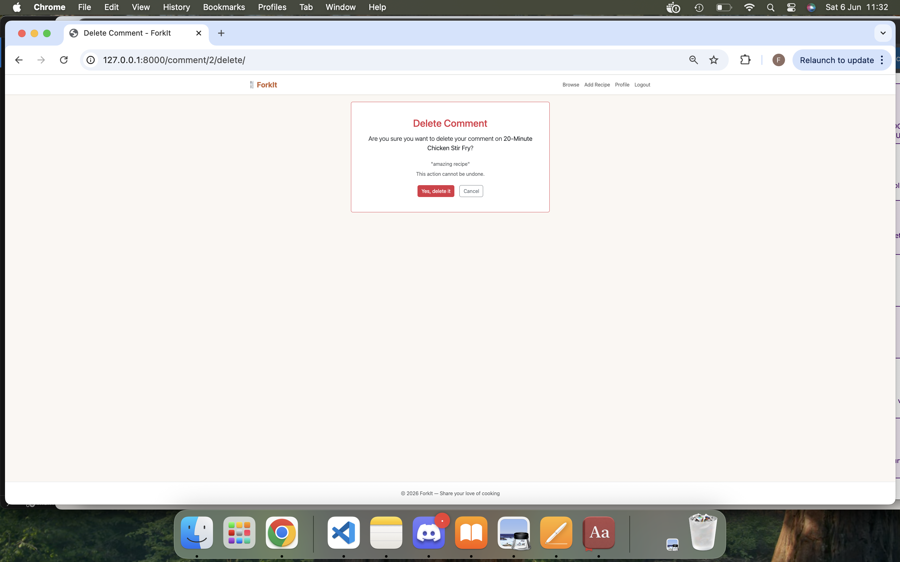

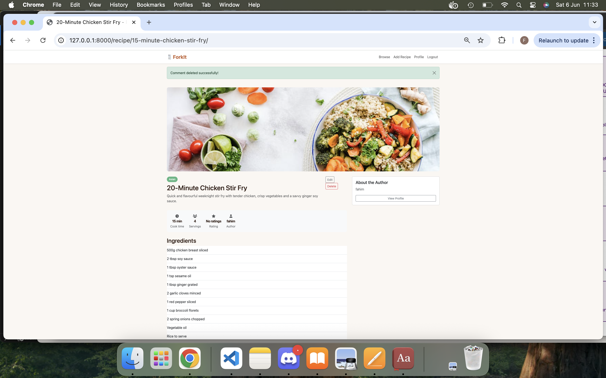

Logged in users can leave comments on any recipe. Comments display
the author's username and date posted. The comment author sees a
Delete button on their own comments. A confirmation page is displayed
before deletion to prevent accidental deletions. On successful deletion
the user is redirected back to the recipe with a success message.

### Ratings


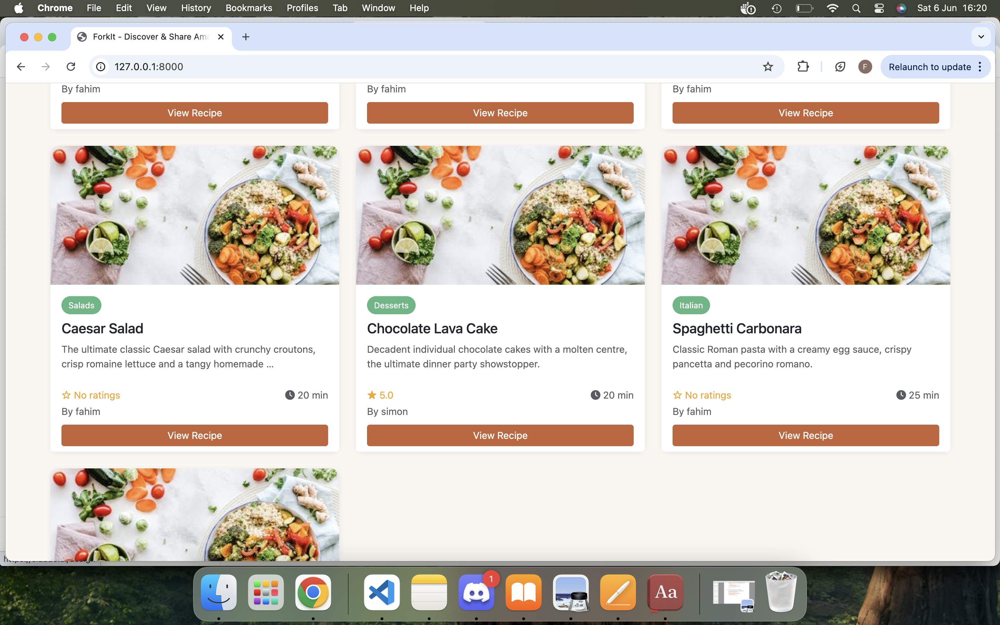

Logged in users can rate any recipe they did not author out of 5 stars.
Each user can only rate a recipe once — submitting a new rating updates
their existing one. The average rating is displayed on both the homepage
card and the recipe detail page.

### Navigation

_(Add screenshot)_

The navbar is fully responsive and collapses to a burger menu on mobile. It displays different links depending on the user's logged-in status:

- **Logged out:** Browse, Login, Register
- **Logged in:** Browse, Add Recipe, Profile, Logout

### Homepage

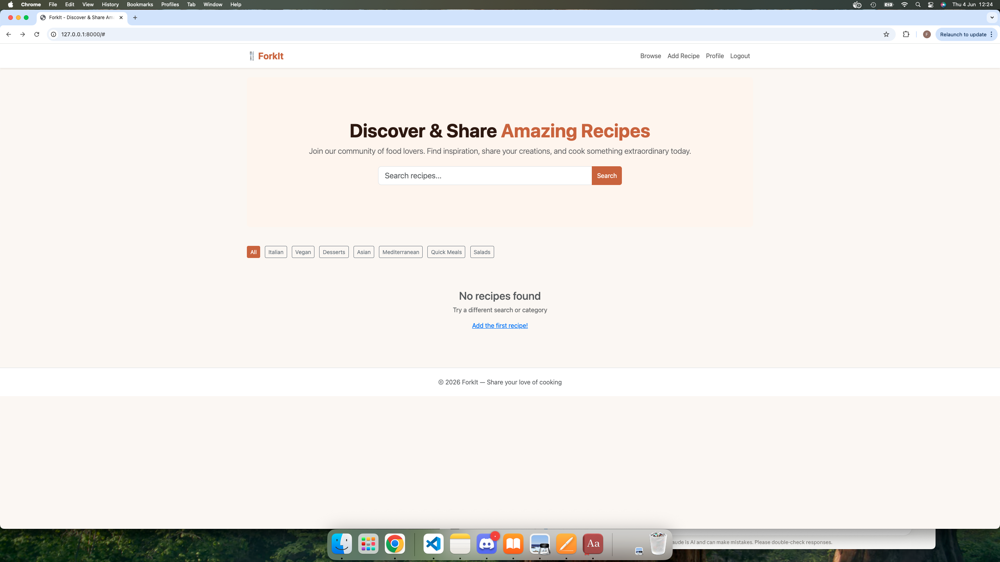

Displays a hero section with a search bar and category filter buttons.
When no recipes exist, a "No recipes found" message is displayed with
a prompt to add the first recipe.
_(Add screenshot)_

Displays a hero section with a search bar and category filter buttons. Below, recipe cards are displayed in a responsive grid showing the recipe image, title, category, rating, cooking time and author.

### Recipe Detail Page

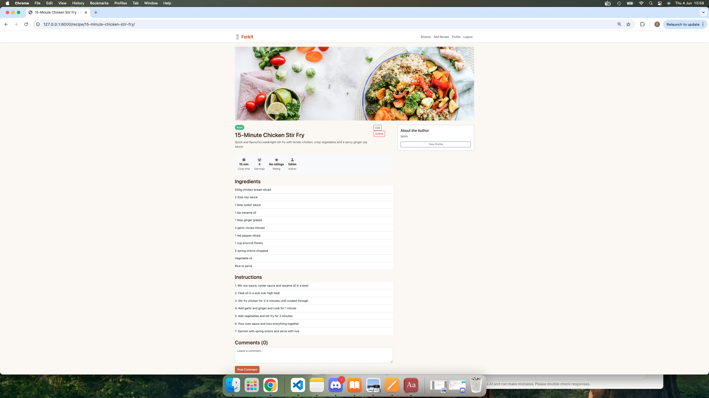

Displays the full recipe including a large header image, category badge,
title, description, cooking time, servings, rating and author. Ingredients
are listed clearly and instructions are displayed as numbered steps.
Logged in users can leave comments and rate the recipe. The recipe author
sees Edit and Delete buttons.

_(Add screenshot)_

Displays the full recipe including a large header image, ingredients list, step-by-step instructions, average star rating, and a comments section.

### Add / Edit Recipe

### Edit Recipe

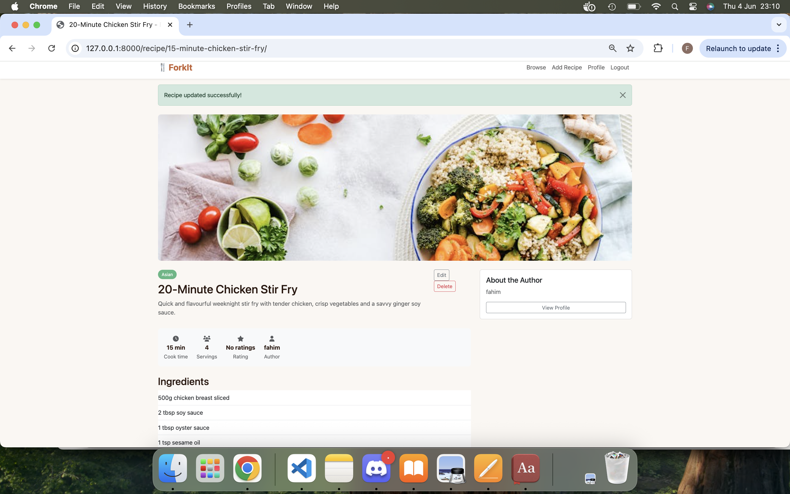

Logged in users can edit their own recipes using the same form as the
create page, pre-populated with the existing recipe data. If a user
attempts to edit another user's recipe they are redirected back to the
recipe detail page with an error message. On successful update the user
is redirected to the recipe detail page with a success message.

### Add / Edit Recipe

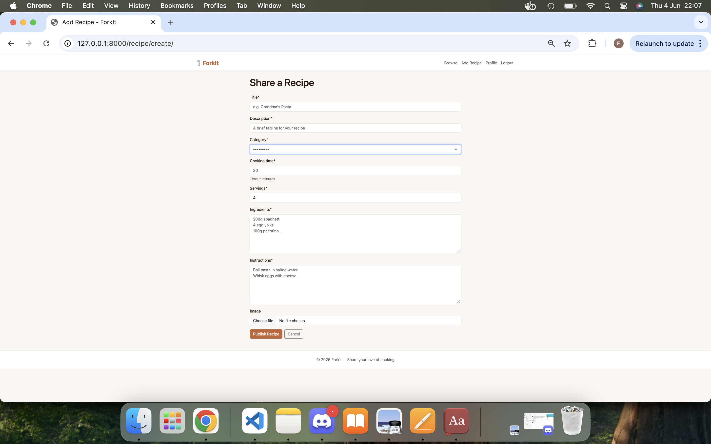

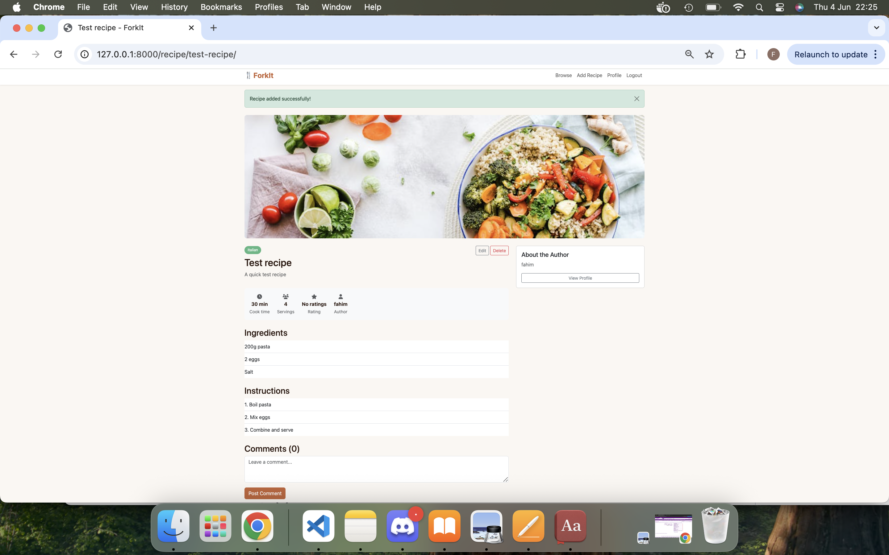

A form allowing logged in users to submit a new recipe using Django's
ModelForm with full validation. On successful submission the user is
redirected to the new recipe's detail page with a success message
displayed. The form includes fields for title, description, category,
cooking time, servings, ingredients and instructions.

### Delete Recipe


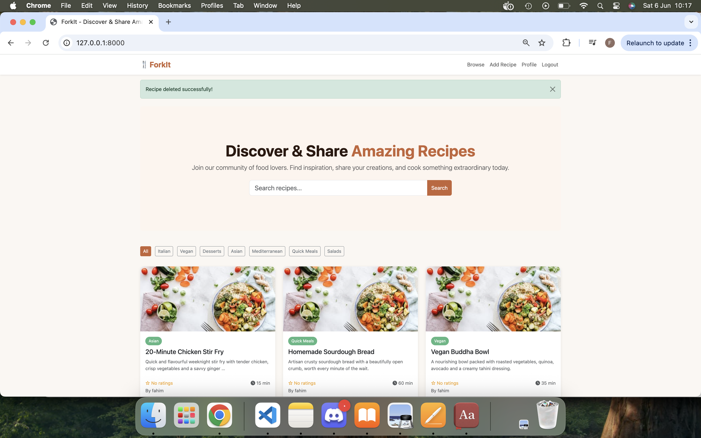

A confirmation page is displayed before deleting a recipe to prevent
accidental deletions. Only the recipe author can delete their own recipes.
On confirmation the recipe is deleted and the user is redirected to the
homepage with a success message.

### Profile Page

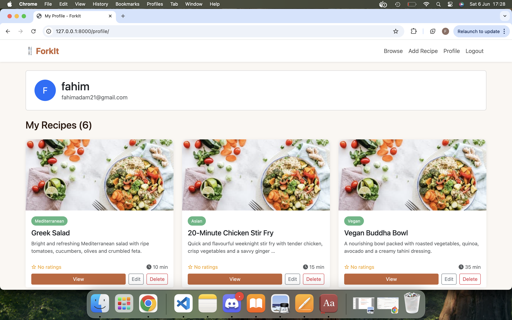

Displays the logged in user's avatar, username and email. Below,
all their posted recipes are shown in a card grid with View, Edit
and Delete buttons for easy management of their content.
_(Add screenshot)_

Displays the user's username, email, bio and a grid of all their posted recipes.

### Login / Register

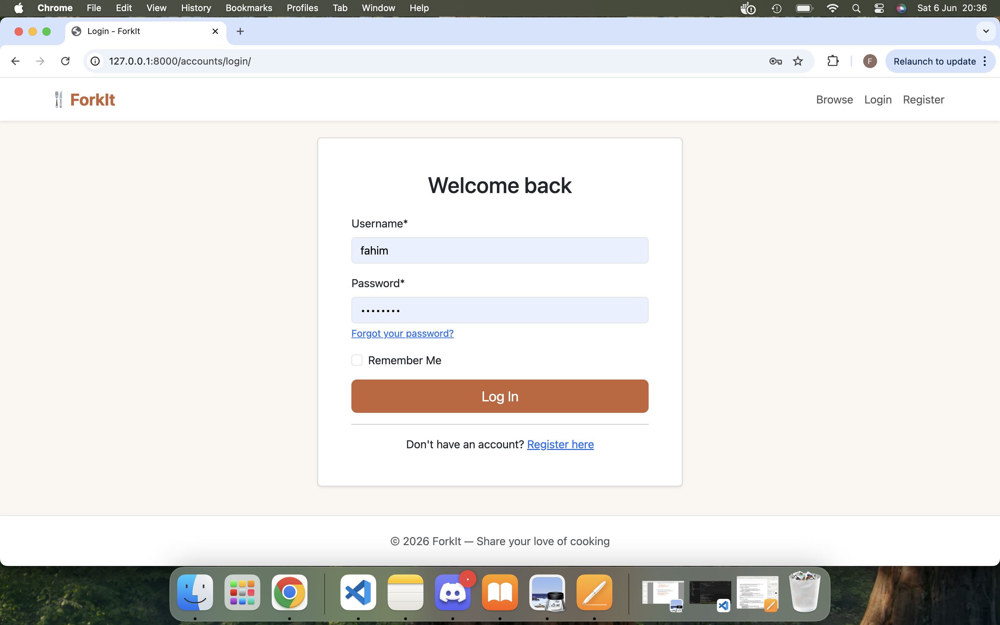

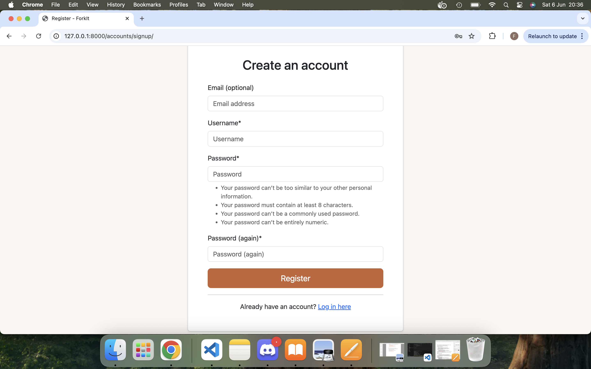

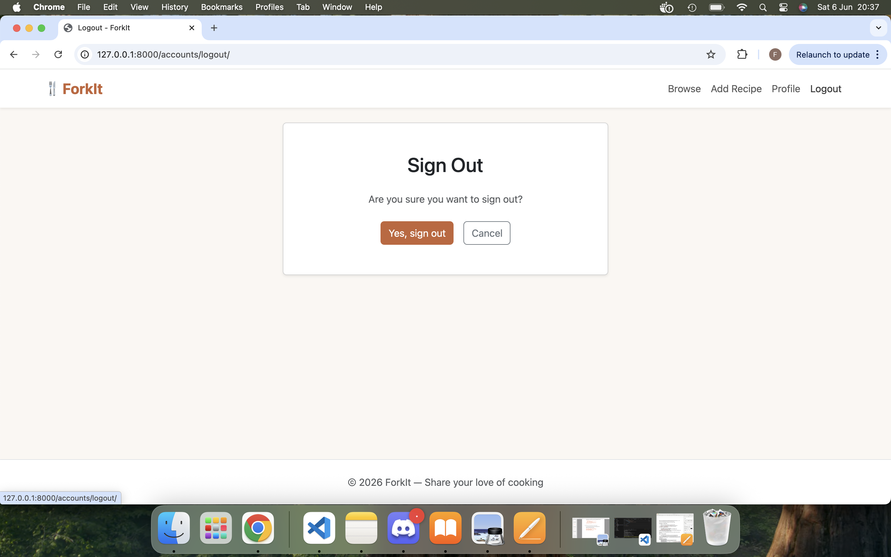

Custom authentication templates built with Django Allauth and Crispy
Forms. The login page allows existing users to sign in. The register
page allows new users to create an account. The logout page asks for
confirmation before signing out. Each page links to the other for
easy navigation.

_(Add screenshot)_

Clean, centred authentication forms built with Django Allauth.

### Delete Confirmation

_(Add screenshot)_

A confirmation modal is displayed before any delete action to prevent accidental deletions.

### Success / Error Messages

_(Add screenshot)_

Django messages framework used throughout to provide feedback on all user actions (create, edit, delete, login, logout).

### Custom 404 Page

_(Add screenshot)_

A custom 404 page redirects users back to the homepage without needing browser navigation buttons.

### Admin Panel

_(Add screenshot)_

The Django admin panel allows the site owner to manage all recipes, categories, comments and ratings.

---

## Technologies Used

**Frontend:**

- HTML5
- CSS3
- Bootstrap 5
- JavaScript

**Backend:**

- Python 3
- Django

**Database:**

- PostgreSQL (via Neon)

**Storage:**

- Cloudinary (media files)

**Deployment:**

- Heroku
- Whitenoise (static files)
- Gunicorn (web server)

**Development Tools:**

- Git & GitHub (version control)
- VS Code
- Chrome DevTools

**Validation Tools:**

- [W3C HTML Validator](https://validator.w3.org/)
- [W3C CSS Validator (Jigsaw)](https://jigsaw.w3.org/css-validator/)
- [CI Python Linter](https://pep8ci.herokuapp.com/)
- Chrome Lighthouse

**Django Packages:**

- django-allauth
- django-crispy-forms
- crispy-bootstrap5
- Pillow
- dj-database-url
- psycopg2-binary
- cloudinary
- django-cloudinary-storage
- whitenoise
- gunicorn

---

## Security Features

- All secret keys and database URLs are stored in environment variables (`env.py` locally, Heroku Config Vars in production)
- `env.py` is listed in `.gitignore` and never committed to the repository
- `DEBUG` is set to `False` in production via environment variable
- All recipe and comment edit/delete views are protected with `@login_required`
- Users can only edit or delete their own content — ownership is checked in every relevant view
- CSRF protection is enabled on all forms
- `MESSAGE_TAGS` configured in `settings.py` to map Django message
  levels to Bootstrap alert classes so error, success and warning
  messages display with correct colours

---

## Deployment

### Prerequisites

Ensure you have the following installed:

- Python 3
- pip
- Git

### Clone the Repository

```bash
git clone https://github.com/fahim2023/forkit
cd forkit
```

### Local Development Setup

1. Create and activate a virtual environment:

```bash
python3 -m venv venv
source venv/bin/activate
```

2. Install dependencies:

```bash
pip install -r requirements.txt
```

3. Create an `env.py` file in the root directory:

```python
import os

os.environ["SECRET_KEY"] = "your-secret-key"
os.environ["DATABASE_URL"] = "your-database-url"
os.environ["CLOUDINARY_URL"] = "your-cloudinary-url"
os.environ["DEBUG"] = "True"
```

4. Run migrations:

```bash
python manage.py migrate
```

5. Load initial category data:

```bash
python manage.py loaddata categories.json
```

> **Note:** Initial category data is stored as a fixture in
> `recipes/fixtures/categories.json`. Run this command any time
> the database is wiped to restore the default categories.

6. Create a superuser:

```bash
python manage.py createsuperuser
```

7. Run the development server:

```bash
python manage.py runserver
```

### Deploy to Heroku

1. Create a Heroku account at [heroku.com](https://heroku.com)
2. Install the Heroku CLI and log in:

```bash
heroku login
```

3. Create a new Heroku app:

```bash
heroku create your-app-name
```

4. Set config vars in Heroku:

```bash
heroku config:set SECRET_KEY='your-secret-key'
heroku config:set DATABASE_URL='your-database-url'
heroku config:set CLOUDINARY_URL='your-cloudinary-url'
heroku config:set DISABLE_COLLECTSTATIC=1
```

5. Push to Heroku:

```bash
git push heroku main
```

6. Run migrations on Heroku:

```bash
heroku run python manage.py migrate
```

---

## Testing

_(This section will be completed after all features are built)_

### Manual Testing

_(Add manual testing table here)_

### Testing User Stories

| User Story                      | Expected Result                        | Pass/Fail |
| ------------------------------- | -------------------------------------- | --------- |
| Browse all recipes as a visitor | Homepage displays recipe grid          |           |
| Search recipes by keyword       | Search returns relevant results        |           |
| Filter recipes by category      | Category filter shows relevant recipes |           |
| View full recipe detail         | Detail page shows all recipe info      |           |
| Register for an account         | Registration form creates new user     |           |
| Log in to account               | Login redirects to homepage            |           |
| Add a new recipe                | Form creates recipe in database        |           |
| Edit own recipe                 | Edit form updates recipe               |           |
| Delete own recipe               | Recipe removed from database           |           |
| Leave a comment                 | Comment appears on recipe page         |           |
| Delete own comment              | Comment removed from page              |           |
| Rate a recipe                   | Rating saved and average updated       |           |
| View profile page               | Profile shows user's recipes           |           |
| Log out                         | Session ended, redirected to homepage  |           |

### Validator Testing

| File   | Validator      | Result         |
| ------ | -------------- | -------------- |
| HTML   | W3C            | _(add result)_ |
| CSS    | Jigsaw         | _(add result)_ |
| Python | CI PEP8 Linter | _(add result)_ |

### Lighthouse

_(Add Lighthouse screenshots here)_

| Page          | Performance | Accessibility | Best Practices | SEO |
| ------------- | ----------- | ------------- | -------------- | --- |
| Homepage      |             |               |                |     |
| Recipe Detail |             |               |                |     |
| Add Recipe    |             |               |                |     |
| Profile       |             |               |                |     |

### Responsiveness

Tested on the following devices and browsers:

| Device  | Browser | Result |
| ------- | ------- | ------ |
| Desktop | Chrome  |        |
| Desktop | Firefox |        |
| Desktop | Safari  |        |
| Tablet  | Chrome  |        |
| Mobile  | Chrome  |        |
| Mobile  | Safari  |        |

---

## Bugs

### Bug 1 — Pillow not installed

- **Issue:** `ImageField` requires Pillow but it was not in the initial dependencies, causing a `SystemCheckError` on `makemigrations`
- **Fix:** Ran `pip install Pillow` and updated `requirements.txt`
- **Screenshot:** 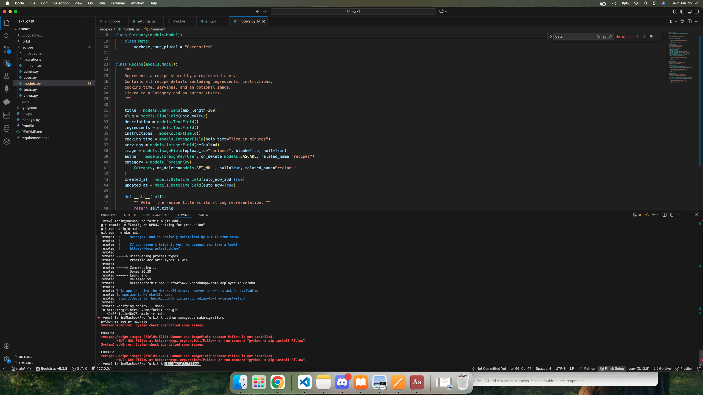

### Bug 2 — NoReverseMatch for recipe_create and profile URLs

- **Issue:** `base.html` referenced `` and
  `` before these URL patterns had been created,
  causing a `NoReverseMatch` error on every page load
- **Fix:** Replaced unbuilt URLs with `#` placeholders in `base.html`
  until the views and URLs are created incrementally
- **Screenshot:** 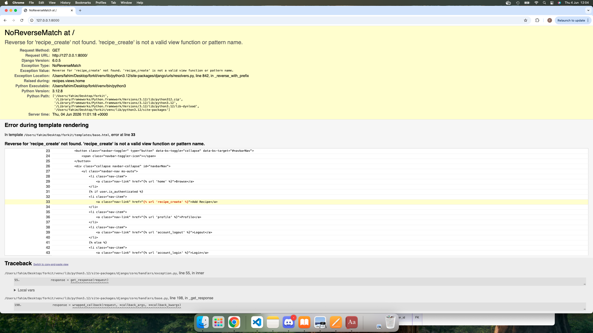

### Bug 3 — URL ordering caused 404 on recipe create page

- **Issue:** `recipe/create/` was being matched by `recipe/<slug:slug>/`
  pattern because the slug URL was defined first in `urls.py`. Django
  treated "create" as a slug and threw a 404.
- **Fix:** Moved `recipe/create/` above `recipe/<slug:slug>/` in
  `urls.py` so specific paths are matched before dynamic ones.
- **Screenshot:** 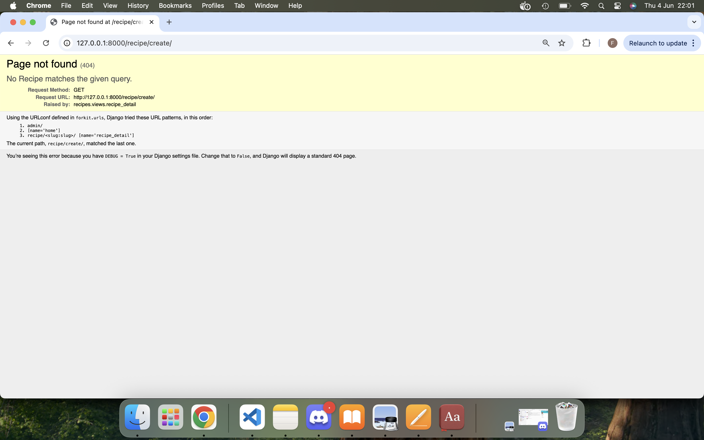

### Bug 4 — Error messages not displaying correct colour

- **Issue:** Django's `messages.error` uses the tag `error` but
  Bootstrap uses `danger` for red alerts, so error messages were
  not styled correctly
- **Fix:** Added `MESSAGE_TAGS` to `settings.py` to map Django
  message levels to Bootstrap CSS classes
  - **Screenshot:** 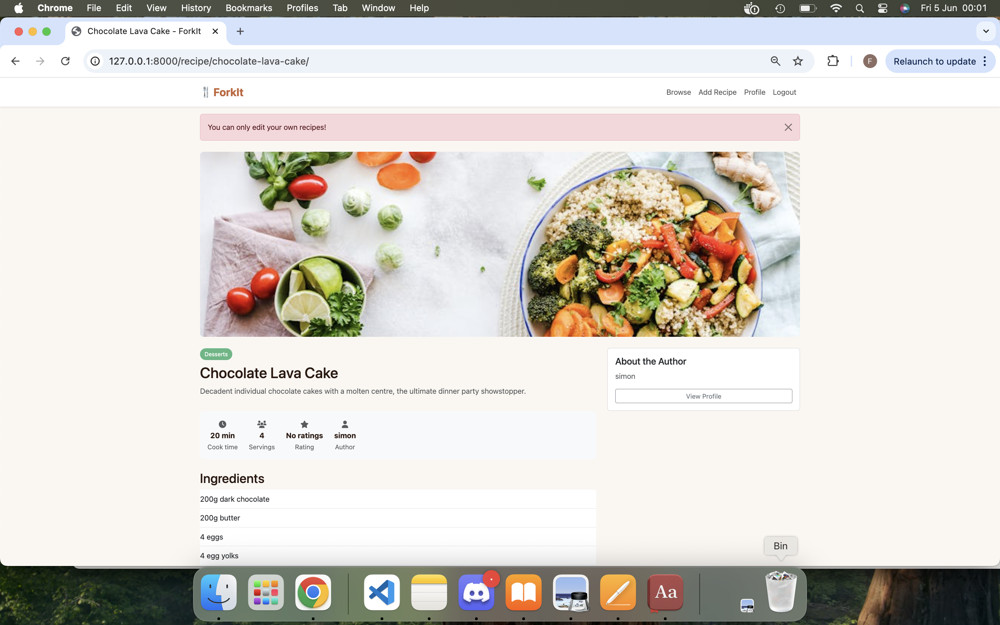

### Bug 5 — Footer not sticking to bottom of page

- **Issue:** Footer was floating in the middle of the page when
  there was not enough content to fill the viewport height
- **Fix:** Added Bootstrap flex utilities to `base.html` —
  `d-flex flex-column min-vh-100` on the body, `flex-grow-1` on
  main and `mt-auto` on the footer to push it to the bottom
- **Screenshot:** 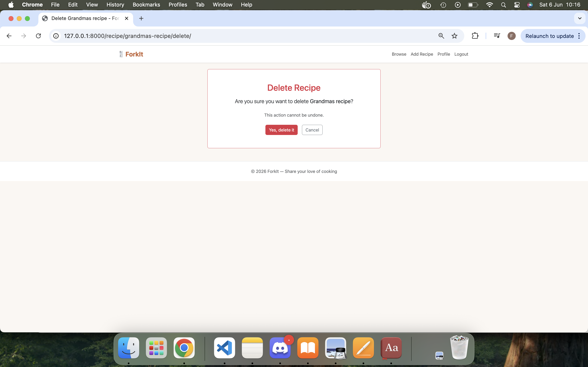

### Bug 6 — Comment submission not working

- **Issue:** Comment submission code was missing from the
  `recipe_detail` view, so comments were not being saved to
  the database
- **Fix:** Added POST request handling to `recipe_detail` view
  to create comments when the form is submitted
- **Screenshot:** 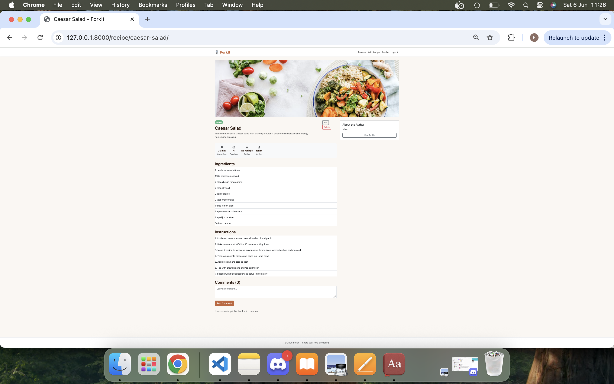

### Bug 7 — Custom 404 page not displaying

- **Issue:** Custom 404 page was not displaying because the
  `404.html` template had not been created and `DEBUG` was set
  to `True` locally which overrides custom error pages
- **Fix:** Created `templates/404.html` template and set
  `DEBUG=False` to test. Custom 404 pages only show when
  `DEBUG=False`
- **Screenshot:** 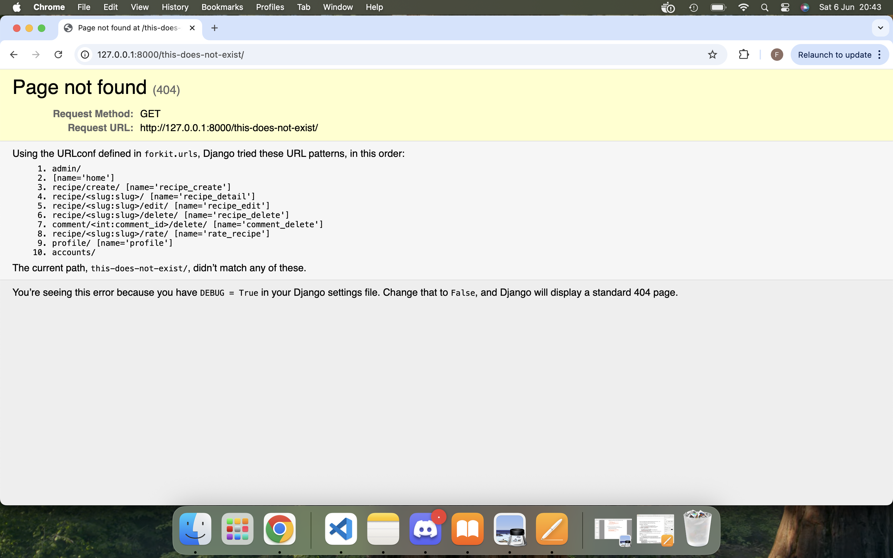

---

## Credits

### Content

- Recipe content and sample data written by the developer

### Media

- Food photography sourced from [Pexels](https://www.pexels.com/) (free to use licence)

### Code

_(Add any external code sources here with attribution)_

### Tools

- [Canva](https://www.canva.com/) — _(if used)_
- [Favicon.io](https://favicon.io/) — favicon generation
- [Amiresponsive](https://ui.dev/amiresponsive) — responsiveness screenshots

### Acknowledgements

_(Add acknowledgements here)_
